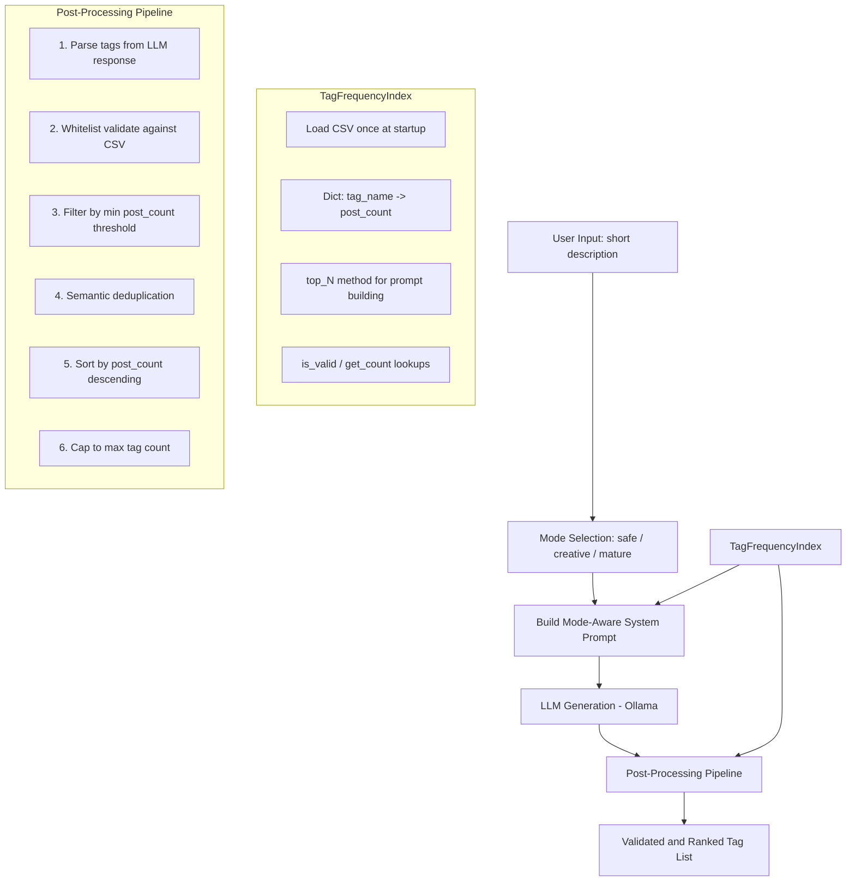

# Prompt Upsampling / Tag Expansion — Architecture Plan

## Problem Summary

The current [`DescriptionTagger`](../backend/description_tagger.py) has two critical issues:

| Mode | Input | Output Problem |
|------|-------|---------------|
| Creative | "a nun giving a blowjob in the alley" | Misses the sexual act entirely; only produces scene/setting tags |
| Mature | "a nun giving a blowjob in the alley" | Generates excessive cum-related tags (12+ variants) that the prompt never mentioned |

**Root causes:**
1. [`_enrich_mature_tags()`](../backend/description_tagger.py:712) — 180-line hardcoded enrichment that unconditionally injects "cum pack" tags on any fellatio detection
2. [`_enrich_tags_with_scene_ideas()`](../backend/description_tagger.py:520) — hardcoded trigger maps that don't consider the full context of the prompt
3. [`danbooru_tags_post_count.csv`](../danbooru_tags_post_count.csv) is loaded as a binary whitelist only — the 1M+ post_count values are **completely ignored**
4. System prompts are verbose but lack vocabulary grounding — the LLM isn't guided toward high-frequency, high-signal tags

---

## Architecture Overview



---

## Phase 1: TagFrequencyIndex

**New file:** `backend/tag_index.py`

A lightweight class that loads the CSV once and provides:

```
class TagFrequencyIndex:
    def load(csv_path) -> None           # Parse CSV into {tag: post_count}
    def get_count(tag) -> int | None     # Lookup post_count
    def is_valid(tag) -> bool            # Tag exists in CSV
    def top_n(n, exclude=None) -> list   # Top N tags by post_count
    def top_by_category(n, keywords)     # Top N tags matching keyword hints
    def min_count_threshold() -> int     # Configurable floor (default: 500)
    def set_min_threshold(n) -> None     # Adjust threshold at runtime
```

**Key design decisions:**
- Loaded once as a singleton (like [`get_tagger()`](../backend/tagger.py:240))
- `top_by_category` uses substring matching against a curated keyword list to build the prompt's "available vocabulary" section (e.g., clothing keywords → top clothing tags)
- post_count threshold is runtime-configurable via the UI

---

## Phase 2: Redesigned LLM Prompts

### Strategy: Vocabulary-Grounded Few-Shot Prompting

Instead of listing all possible tags in the prompt (which causes the LLM to regurgitate them all), we:

1. Include a **curated vocabulary section** with top-50 tags organized by category (character, clothing, setting, action, style, explicit)
2. Use **2–3 few-shot examples** that demonstrate the desired output format and tag selection style
3. Give **clear constraint instructions** about not adding unmentioned elements
4. Guide the LLM to **prefer common, high-signal tags**

### Prompt Template (all modes share this structure):

```
You are a Danbooru-style image tag generator. Convert the user's description
into a comma-separated list of tags.

RULES:
- Output ONLY tags separated by commas. No prose, no markdown, no explanations.
- Use lowercase with underscores for spaces.
- Prefer tags from the AVAILABLE VOCABULARY below — they are the most commonly used.
- Only add tags that are DIRECTLY implied by the description. Do not invent.
- Aim for {target_count} tags total.

AVAILABLE VOCABULARY (most common Danbooru tags):
- Character/Participants: {top_character_tags}
- Clothing/Accessories: {top_clothing_tags}
- Setting/Environment: {top_setting_tags}
- Action/Pose: {top_action_tags}
- Style/Quality: {top_style_tags}
{mode_specific_vocabulary_section}

EXAMPLES:
Input: "cat girl sitting on a bench in the park"
Output: 1girl, cat_ears, cat_tail, sitting, bench, park, outdoors, day, sky, tree, smile, short_hair, blue_skirt

Input: "a nun giving a blowjob in the alley"
Output: 1girl, 1boy, nun, habit, fellatio, kneeling, alley, night, street, open_mouth, penis, blush, saliva

NOW CONVERT:
{user_description}
```

### Mode-Specific Variations (3 modes total):

| Mode | Vocabulary includes | Temperature | Target Count | Purpose |
|------|--------------------|-------------|-------------|---------|
| safe | General only (no explicit) | 0.45 | 12–16 | Literal, conservative tagging |
| creative | General + mild action | 0.58 | 18–24 | Scene/character expansion |
| mature | General + explicit acts/anatomy | 0.80 | 20–30 | Adult/Rule34 content |

All three modes share the same pipeline: LLM generation with vocabulary-grounded prompts → post-processing (validate → threshold → dedup → sort → cap). The "prompt upsampling" concept is baked into how every mode works — the LLM always receives the short user input and expands it using the mode's vocabulary constraints. No separate upsample mode needed.

### Few-Shot Examples per Mode:

Each mode gets 2–3 tailored examples that demonstrate the right level of detail and tag selection style. The mature mode examples will show how to handle explicit content WITHOUT over-generating (e.g., no cum tags unless the prompt mentions cum).

---

## Phase 3: Remove Hardcoded Enrichment

**DELETE** these methods from [`description_tagger.py`](../backend/description_tagger.py):

- `_enrich_tags_with_scene_ideas()` (line 520–636) — ~116 lines
- `_enrich_mature_tags()` (line 712–894) — ~182 lines
- `_POSITION_CONFLICT_GROUPS` (line 640–655)
- `_detect_primary_act()` (line 657–681)
- `_strip_conflicting_positions()` (line 683–710)
- All hardcoded trigger maps and act packs

**KEEP** these methods (they're still useful):

- `_extract_actor_tags_from_description()` — participant counting from text
- `_extract_literal_tags_from_description()` — direct phrase→tag mapping
- `_parse_tags()` — response parsing (but enhanced with post-count filtering)
- `_clean_response_text()` — response cleanup

---

## Phase 4: Post-Processing Pipeline

After the LLM returns tags, a new `_post_process_tags()` method runs:

### Step 1: Parse
Extract tags from raw LLM response (existing `_parse_tags` logic).

### Step 2: Whitelist Validate
Only keep tags that exist in the Danbooru CSV.

### Step 3: Post-Count Threshold Filter
Remove tags with post_count below a configurable minimum (default: 500).
This eliminates obscure/rare tags that would weaken generation results.

### Step 4: Semantic Deduplication
Merge near-synonym tags using a curated synonym map. Examples:
- `cum_in_mouth, cum_on_lips, cum_on_tongue` → keep only `cum_in_mouth` (highest post_count)
- `blowjob, fellatio, oral` → keep `fellatio` (standard Danbooru tag)
- `dark, darkness, dim_lighting` → keep `dark` or `night` depending on context

The synonym map will be maintained as a module-level constant:

```python
_SEMANTIC_DEDUP_MAP: dict[str, str] = {
    # Canonical → [synonyms to merge]
    "fellatio": ["blowjob", "oral", "bj", "sucking_dick"],
    "cum_in_mouth": ["cum_on_lips", "cum_on_tongue", "cum_in_throat", "cum_on_face"],
    "night": ["darkness", "dim_lighting", "dark", "low_light"],
    "alley": ["alleyway", "back_alley"],
    # ... etc
}
```

**Algorithm:** For each generated tag, check if it's a synonym of an already-included canonical tag. If so, skip it. If it IS the canonical, add it and mark all its synonyms as "seen".

### Step 5: Sort by Post-Count
Sort remaining tags by post_count descending. This puts the strongest, most common tags first — which is what image generation models respond to best.

### Step 6: Cap
Trim to the mode's configured max tag count.

---

## Phase 5: Refactored `generate_tags()` Flow

The creativity validation in the existing code (line 337 of description_tagger.py) currently checks `{"safe", "creative", "extreme", "mature"}`. This changes to `{"safe", "creative", "mature"}`.

```python
def generate_tags(self, description, creativity):
    # 1. Build system prompt using TagFrequencyIndex for vocabulary
    system_prompt = self._build_system_prompt_v2(creativity)
    
    # 2. Build generation prompt with few-shot examples
    gen_prompt = self._build_generation_prompt_v2(description, creativity)
    
    # 3. Call LLM
    response = self.client.generate(
        model=self.model,
        prompt=gen_prompt,
        system=system_prompt,
        options={temperature, top_p, ...},
        stream=False,
    )
    
    # 4. Post-process
    tags = self._post_process_tags(
        response["response"],
        creativity=creativity,
    )
    
    # 5. Inject literal/actor tags at front (participant counts, etc.)
    tags = self._inject_literal_tags(description, tags)
    
    return DescriptionTagResult(tags=tags, raw_response=..., model=...)
```

Mode options (replaces lines 351-357):

```python
mode_options = {
    "safe":     {"base_temp": 0.45, "num_predict": 140, "target_tags": 16},
    "creative": {"base_temp": 0.58, "num_predict": 180, "target_tags": 24},
    "mature":   {"base_temp": 0.80, "num_predict": 280, "target_tags": 30},
}
```

---

## Phase 6: Frontend Changes

### [`workers.py`](../frontend/native/workers.py)
- No changes needed — `DescriptionTagWorker` already passes `creativity` through

### [`main_window.py`](../frontend/native/main_window.py)
- Remove "extreme" from the creativity dropdown (keep safe, creative, mature)
- Add a "Min Post Count" spinner (default: 500, range: 0–50000)

### [`description_tagger.py`](../backend/description_tagger.py)
- Add `post_count_threshold` parameter to `generate_tags()`
- Pass it through to `_post_process_tags()`

---

## Phase 7: Testing Strategy

Test with the user's problematic prompt across all modes:

| Mode | Expected behavior |
|------|------------------|
| safe | `1girl, nun, alley, night, street, standing, robe, cross` — no explicit content |
| creative | `1girl, nun, alley, night, street, habit, moonlight, shadow` — scene-focused, minor action hints |
| mature | `1girl, 1boy, nun, habit, fellatio, kneeling, alley, night, open_mouth, penis, erection, saliva, blush, street` — explicit but NO cum tags unless prompt mentions cum |

---

## Files to Create/Modify

| File | Action | Description |
|------|--------|-------------|
| `backend/tag_index.py` | **CREATE** | TagFrequencyIndex class |
| `backend/description_tagger.py` | **MODIFY** | Remove enrichment methods, add post-processing, rewrite prompts |
| `frontend/native/main_window.py` | **MODIFY** | Remove extreme mode, add post_count threshold UI |
| `plans/prompt-upsampling.md` | **CREATE** | This plan document |

---

## Implementation Order

1. Create `TagFrequencyIndex` — it's the foundation everything else depends on
2. Rewrite system/generation prompts in `DescriptionTagger`
3. Build `_post_process_tags()` with the 6-step pipeline
4. Remove all hardcoded enrichment code
5. Wire up the new flow in `generate_tags()`
6. Update UI (remove extreme, add post_count spinner)
7. Test end-to-end
